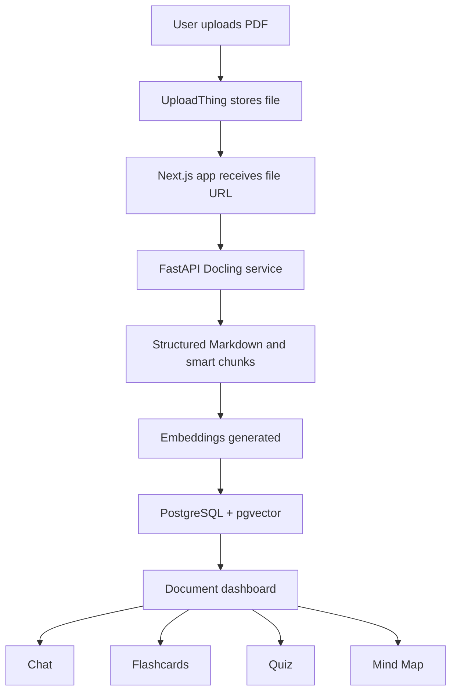
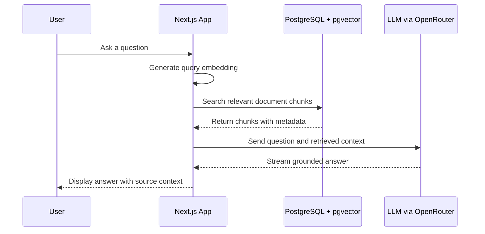

# DocuMind

**Backend document-processing microservice:** [structured_pdf_data](https://github.com/deepnav4/structured_pdf_data)

DocuMind is a structured PDF intelligence platform that turns PDFs into an interactive study workspace. Users can upload a document and generate AI-powered chat, flashcards, quizzes, and mind maps from it.

The project is built around a simple idea: PDFs should not remain passive files. A PDF should be searchable, explainable, testable, and reusable as a learning system.

## What It Does

After uploading a PDF, DocuMind can:

- **Chat with the PDF:** Ask natural-language questions and receive document-grounded answers.
- **Generate flashcards:** Convert important concepts into question-answer revision cards.
- **Generate quizzes:** Create multiple-choice questions from the document for self-testing.
- **Generate mind maps:** Visualize the main topic, subtopics, and relationships inside the PDF.
- **Process difficult PDFs:** Handle structured, unstructured, scanned, table-heavy, or messy PDFs more intelligently through a dedicated Docling backend.

DocuMind is designed for students, researchers, teachers, technical learners, and professionals who work with dense documents and want a faster way to understand them.

## Why I Built It

Most people still study and work from PDFs, but the workflow is usually inefficient.

Traditionally, users open a PDF, scroll through pages, search for keywords, reread paragraphs, write notes manually, and then create their own revision questions. Recently, many users also upload PDFs into general-purpose chatbots. That can help, but it is not a complete study workflow.

General chatbots are not always optimized for:

- Preserving page numbers and document structure
- Handling scanned or poorly formatted PDFs
- Producing consistently structured flashcards or quizzes
- Turning outputs into reusable project data
- Moving smoothly between the original PDF, chat, flashcards, quizzes, and mind maps

DocuMind solves this by converting a PDF into a persistent, structured study workspace instead of treating it as a one-time chatbot attachment.

## Tech Stack

### Frontend and App Layer

- **Next.js**
- **React**
- **TypeScript**
- **Tailwind CSS**
- **Radix/Shadcn-style UI components**
- **Vercel AI SDK**

### Backend and Data Layer

- **Next.js API Routes**
- **Server Actions**
- **Prisma**
- **PostgreSQL**
- **pgvector**
- **NextAuth**
- **UploadThing**

### AI and Retrieval

- **OpenRouter**
- **Vercel AI SDK**
- **Embedding generation**
- **Tool calling**
- **Structured object generation**
- **Retrieval-Augmented Generation**

### Document Processing Microservice

- **Python**
- **FastAPI**
- **IBM Docling**
- **PyPdfium backend**
- **HybridChunker**
- **Hugging Face tokenizer**

The document-processing microservice is separate from this main Next.js app because PDF parsing is heavy and because Docling is a Python-based library. Keeping it in a dedicated FastAPI service allows the main app to remain responsive while the document intelligence work runs in the ecosystem best suited for it.

## System Architecture

DocuMind has two major parts:

1. **Main Next.js application**
2. **FastAPI Docling microservice**

The Next.js app handles the user interface, authentication, uploads, AI orchestration, generated content, database operations, and document dashboards.

The FastAPI service handles structured PDF parsing and chunking. It receives a PDF URL, processes the document with Docling, and returns Markdown or document-aware chunks with metadata.



## Document Processing With Docling

The most important part of the system is the structured PDF retrieval backend.

Instead of using basic text extraction, DocuMind uses Docling through a dedicated FastAPI service. This allows the system to extract structured content from PDFs and preserve important metadata.

The service can return:

- Full structured Markdown for smaller documents
- Smart chunks for larger documents
- Page numbers
- Headings
- Content labels
- Filename metadata
- Section-aware chunk information

The microservice uses:

- `DocumentConverter`
- `PdfPipelineOptions`
- `PyPdfiumDocumentBackend`
- `AcceleratorOptions(num_threads=1, device="cpu")`
- `HybridChunker`
- `HuggingFaceTokenizer`
- `nvidia/llama-nemotron-embed-vl-1b-v2` tokenizer

The thread limit is intentional. Complex PDF parsing can cause memory spikes, so the service restricts CPU threading to improve stability and avoid out-of-memory failures.

## RAG Pipeline

For document chat, DocuMind uses Retrieval-Augmented Generation.



The chat pipeline does not blindly send the entire PDF to the model. It searches the document first, retrieves relevant chunks, and then asks the model to answer using that context.

This improves:

- Accuracy
- Source grounding
- Page-aware responses
- Performance on larger documents
- User trust

## Vercel AI SDK Usage

The Vercel AI SDK is used as the main AI orchestration layer.

It helps with:

- Streaming chatbot responses
- Converting UI messages into model messages
- Generating embeddings
- Calling tools during chat
- Generating structured JSON outputs
- Keeping AI routes consistent across the app

Structured generation is especially useful for features like flashcards and quizzes. The frontend needs predictable data, not free-form text. The Vercel AI SDK allows the app to define schemas so model responses can be returned in the exact shape required by the UI.

For example, quiz generation needs:

- Question text
- Four options
- Correct option index
- Explanation
- Continuous ordering

Flashcards need:

- Question
- Answer
- Index
- Source metadata when available

This avoids fragile text parsing and makes the AI output directly usable by the application.

## Core Workflows

### Chat With PDF

1. User uploads a PDF.
2. The file is stored with UploadThing.
3. The PDF URL is sent to the FastAPI Docling service.
4. The service returns smart chunks.
5. The app generates embeddings for each chunk.
6. Chunks and embeddings are saved in PostgreSQL with pgvector.
7. User asks a question.
8. The app performs semantic search over the chunks.
9. The LLM answers using retrieved document context.

### Flashcards

1. User uploads a PDF and selects Flashcards.
2. The PDF is parsed into chunks.
3. The user chooses how many flashcards to generate.
4. Chunks are sent in batches to the AI route.
5. The Vercel AI SDK returns structured flashcard objects.
6. Flashcards are saved as generated content.
7. The dashboard renders them as an interactive study experience.

### Quizzes

1. User uploads a PDF and selects Quiz.
2. Chunks are generated from the PDF.
3. The user chooses the target number of questions.
4. The AI generates structured multiple-choice questions.
5. Quiz data is saved in the database.
6. User attempts can be tracked through progress records.

### Mind Maps

1. User uploads a PDF and selects Mind Map.
2. The system decides whether to use full Markdown or chunks.
3. Large documents are summarized in batches first.
4. A final nested mind map structure is generated.
5. The dashboard renders it visually.

## Database Design

The Prisma schema includes:

- `User`: Authenticated users.
- `Document`: Uploaded PDF projects.
- `DocumentChunk`: Parsed chunks, metadata, and optional vector embeddings.
- `GeneratedContent`: Flashcards, quizzes, and mind maps.
- `FeatureProgress`: User progress, quiz attempts, scores, and completion state.
- `PdfSummary`: Summary storage from earlier/related flows.
- `Account`, `Session`, `VerificationToken`: NextAuth models.

The `DocumentChunk` model stores embeddings with `vector(2048)`, enabling semantic search through pgvector.

## Why It Is Different

DocuMind is not only a PDF chatbot.

It is a PDF-to-study-workspace system.

Tools like NotebookLM are strong for source-grounded chat and summaries. DocuMind focuses more directly on study workflows:

- Chat with the document
- Generate flashcards
- Generate quizzes
- Generate mind maps
- Preserve project data
- Track generated content
- Use a custom Docling-based parsing pipeline

The structured PDF backend is one of the main differentiators. Better parsing creates better chunks. Better chunks create better retrieval. Better retrieval creates better AI responses.

## Current Upload Behavior

- Authenticated users can upload PDFs.
- Uploads are handled through UploadThing.
- Current upload limit is one PDF up to 8 MB.
- Uploaded documents are saved as user-owned projects.

## Getting Started

### Prerequisites

- Node.js
- npm
- PostgreSQL database with pgvector enabled
- UploadThing account
- OpenRouter API key
- Google OAuth credentials for NextAuth
- Running Docling FastAPI microservice

### Install Dependencies

```bash
npm install
```

### Environment Variables

Create a `.env` file with the required values for:

```bash
DATABASE_URL=
DIRECT_URL=
AUTH_SECRET=
AUTH_GOOGLE_ID=
AUTH_GOOGLE_SECRET=
UPLOADTHING_TOKEN=
OPENROUTER_API_KEY=
NEXT_PUBLIC_PYTHON_API_URL=http://localhost:8000
```

The exact names may vary depending on deployment configuration, but the app requires database, auth, upload, and AI provider credentials.

### Generate Prisma Client

```bash
npx prisma generate
```

### Run Development Server

```bash
npm run dev
```

The app will run locally through Next.js.

The structured PDF backend lives here:

[https://github.com/deepnav4/structured_pdf_data](https://github.com/deepnav4/structured_pdf_data)

That service is responsible for Docling-powered structured PDF parsing and chunk generation.

## Project Status

DocuMind is an active full-stack AI project focused on document intelligence and study workflows. It demonstrates:

- Full-stack product engineering
- AI SDK orchestration
- RAG architecture
- Structured LLM output generation
- Vector database search
- Microservice design
- PDF parsing with Docling
- Production-style user workflows

## Summary

DocuMind turns PDFs into interactive learning systems.

It combines structured document parsing, semantic retrieval, AI generation, and a polished dashboard to help users understand, revise, and test themselves from any PDF more effectively.
